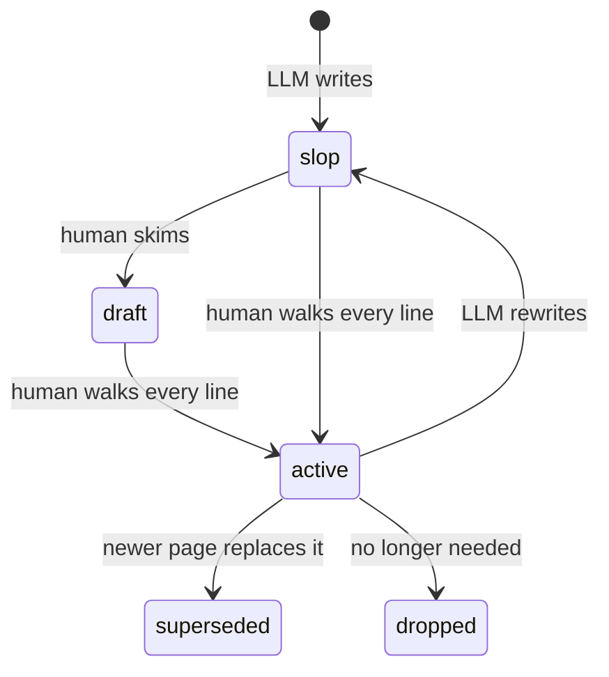
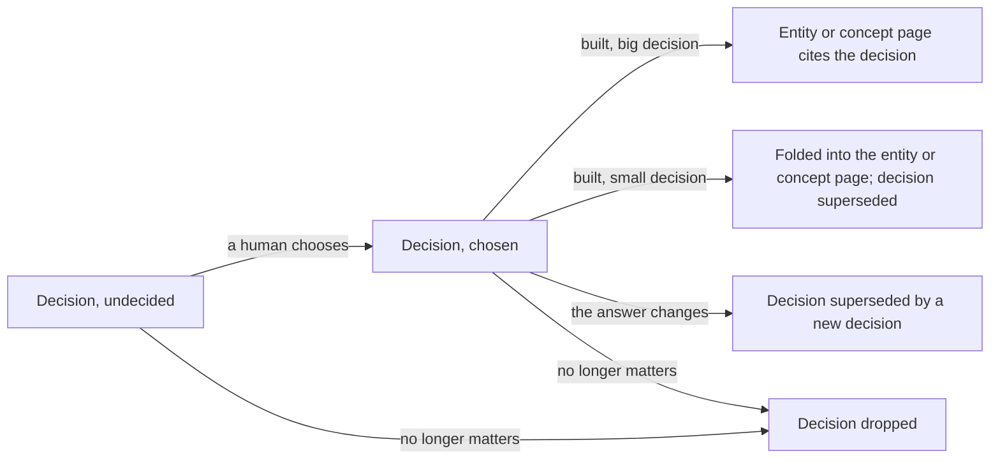

Every page carries three **orthogonal** signals. Never conflate them.

| Signal | Describes | Set by |
|---|---|---|
| `status:` | where the author places the text in its lifecycle | the author, often an LLM |
| `implementation:` | whether the software the page describes exists yet | anyone, human or LLM: it is a fact checkable against the code |
| `approved_by:` | who read the page and vouches for the text | humans only |

The first two answer different questions. A page can be `slop` and `built`: live software documented by prose nobody has proofread. A page can be `active` and `planned`: a design somebody has read every line of, for something that does not exist yet. Both are ordinary.

## The five statuses

- **`slop`**: fresh LLM writing that no human has read. Every page an LLM creates or substantially rewrites starts here. Lifted only when a human has walked every line and takes responsibility for the text.
- **`draft`**: in progress. Read with caution, and do not coordinate work on it as if it were settled.
- **`active`**: current knowledge or an accepted decision. Safe to build on without re-asking.
- **`superseded`**: replaced. `superseded_by:` is mandatory. The body is rewritten into what was proposed and why it was dropped.
- **`dropped`**: no longer matters, and nothing replaces it: the feature was cut, the question went away. The first paragraph says why and when. No `superseded_by:`.

One word, no compound values. Nuances like "behind a feature flag" go into the first body paragraph.

**Whether a decision is made is not a status.** A decision page with no `## Chosen` section shows an `undecided` chip under its title, worked out from the page on every build; the status beside it still says whether a human has read the options. A retired `open` status once did both jobs, so a machine-written decision still waiting on a choice showed `open` and hid that nobody had read it. The lint refuses `status: open`.

**Retired pages stay out of the way.** Superseded and dropped pages are left out of the sidebar, the folder lists and the folder build counts, so they do not clutter the wiki. They still open from search, from links and by their URL, so the record is there for whoever goes looking.

## Whether the thing exists

`implementation:` answers one question: is the software this page describes running?

- **`planned`**: nothing the page describes is built. Every line is a design.
- **`partial`**: some of it ships and some does not.
- **`built`**: everything material on the page runs in production now.

The field is required in the **implementation folders** and refused everywhere else: the wiki's own conventions, or a page about the organization, are neither built nor planned. The implementation folders are `technical/` and `product/` unless the project lists others under `implementationFolders` in `silica.config.json` at the wiki root.

**A folder page has no value of its own.** A folder holds several things at different stages, so one word for all of them says little and goes stale the first time a page inside ships. Its badge instead counts the pages under it (for example "3 built, 1 partly built, 1 planned"), worked out on every build; superseded pages are left out. The lint refuses `implementation:` on a folder's `index.md`.

**A `partial` page marks its unbuilt parts.** Every paragraph, bullet or section describing something that does not exist yet begins with `PLANNED:`. The lint fails a `partial` page with no marker, and a marker on a page that is all plan or all built.

**A long plan is split by phase so its parts can go `built`.** A page covering six months of work sits at `partial` for six months and tells a reader nothing. Where phases ship separately, each gets its own page and flips to `built` as it lands.

**A defect is not an unbuilt feature.** Code that ships broken still exists. It goes under the page's own `## Traps` and the page stays `built`.

**The value is re-read, not inherited.** A page written before its subject existed goes on saying `planned` through every later edit unless somebody checks. Editing a page in an implementation folder includes reading its value against the code and correcting it in the same commit.

**Moving between two values clears `approved_by`.** What gets built is never quite what was planned, so a vouch for the plan does not cover the built thing.

## `approved_by`

- Absent or empty means "not verified". It is neutral, not an accusation.
- Format: `approved_by: [{ who: <name>, when: YYYY-MM-DD }]`. One person is one entry, whatever the spelling of their name.
- A substantial LLM rewrite of a reviewed page sets it back to `slop` and clears `approved_by`: the vouch applied to the old text. Git keeps the reviewed version.
- The lint refuses a `slop` page that still carries an approval.

## How a human promotes a page

There is no button on the published page yet. A human edits the frontmatter and commits:

1. Read the page top to bottom, fix what is wrong, and check its claims.
2. Set `status: active` (or `draft` if it is a reasonable start but not settled).
3. Add yourself: `approved_by: [{ who: <your name>, when: <today> }]`, and set `updated:` to today.
4. Commit with a message such as `status(<page>): slop → active`.

An LLM may *propose* a promotion. It never sets `approved_by` and never promotes its own page.

## Status transitions

## From decision to description

Not every page starts as a decision: a page about something that already exists starts as an entity or a concept. But anything still to be chosen starts as a decision page, and it ends one of three ways: built and described elsewhere, replaced, or dropped.

1. **Undecided.** The decision page lists options and has no `## Chosen` section, so its badge says `undecided`.
2. **Chosen.** A human picks an option. The page gains `## Chosen:` and `## Why`, and the chip goes.
3. **Built, and described elsewhere.** As the choice is built, the decision's `implementation:` moves to `partial` or `built`, and what now exists gets an entity page (one thing: a server, a service, a form) or a concept page (a practice that spans several). That page says what exists and how it works. What happens to the decision depends on its size:
   - **A big decision keeps its own page**, and the entity or concept page cites it in one line for the why. Big means real alternatives that someone may want to revisit: the rejected options and the reasons are what they will need.
   - **A small decision folds in.** Its choice and reasons become a short `## Why` section on the entity or concept page, and the decision page is set to `superseded` with `superseded_by:` pointing at that page.

   The lint fails a decision that is `partial` or `built`, not retired, and linked from no entity or concept page.
4. **Replaced.** If the answer changes, a new decision page supersedes the old one, and the entity or concept page is updated and cites the new decision.
5. **Dropped.** If the question stops mattering, the decision is set to `dropped`, with a line on why.

A page never changes type. A decision rewritten into a description would erase the options and reasons it is there to keep; the description goes on its own page. That page is new like any other: it starts at `slop` and earns its status on its own text, and reviewing one page does not vouch for the other.

## Open questions

- 2026-10-02: Promotion is a hand edit of the frontmatter. Whether to build an on-page status selector, as some Quartz wikis have, depends on where the wiki is hosted and who edits it without git. Nobody has decided.

## Related

- [[format-standard]]: the page-writing spec this model plugs into.
- [[decision-template]]: how a decision page goes from undecided to chosen, and what it hands off once built.
