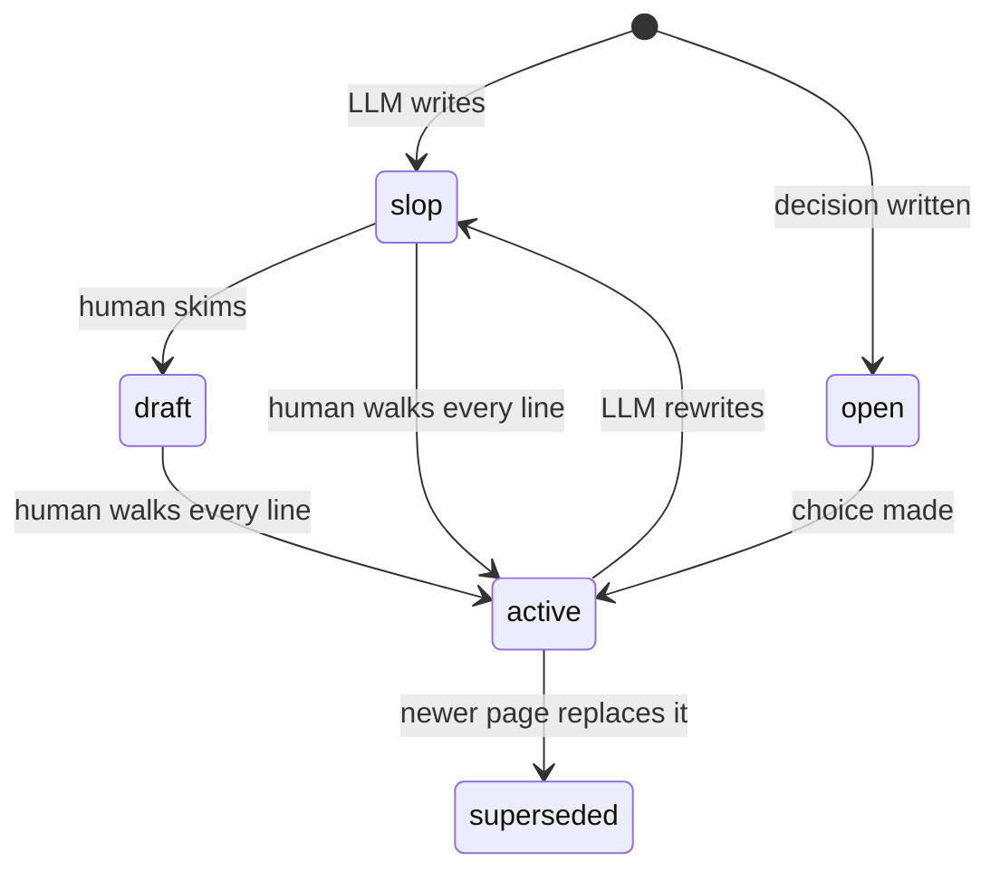

Every page carries three **orthogonal** signals. Never conflate them.

| Signal | Describes | Set by |
|---|---|---|
| `status:` | where the author places the text in its lifecycle | the author, often an LLM |
| `implementation:` | whether the software the page describes exists yet | anyone, human or LLM: it is a fact checkable against the code |
| `approved_by:` | who read the page and vouches for the text | humans only |

The first two answer different questions. A page can be `slop` and `built`: live software documented by prose nobody has proofread. A page can be `active` and `planned`: a design somebody has read every line of, for something that does not exist yet. Both are ordinary.

## The five statuses

- **`slop`**: fresh LLM writing that no human has read. Every page an LLM creates or substantially rewrites starts here. Lifted only when a human has walked every line and takes responsibility for the text.
- **`draft`**: in progress. Read with caution, and do not coordinate work on it as if it were settled.
- **`active`**: current knowledge or an accepted decision. Safe to build on without re-asking.
- **`open`** (*decision pages only*): the options are written up and the choice is not made. The required action is "decide".
- **`superseded`**: replaced. `superseded_by:` is mandatory. The body is rewritten into what was proposed and why it was dropped.

One word, no compound values. Nuances like "behind a feature flag" go into the first body paragraph.

## Whether the thing exists

`implementation:` answers one question: is the software this page describes running?

- **`planned`**: nothing the page describes is built. Every line is a design.
- **`partial`**: some of it ships and some does not.
- **`built`**: everything material on the page runs in production now.

The field is required in the **implementation folders** and refused everywhere else: the wiki's own conventions, or a page about the organization, are neither built nor planned. The implementation folders are `technical/` and `product/` unless the project lists others under `implementationFolders` in `silica.config.json` at the wiki root.

**A folder page has no value of its own.** A folder holds several things at different stages, so one word for all of them says little and goes stale the first time a page inside ships. Its badge instead counts the pages under it (for example "3 built, 1 partly built, 1 planned"), worked out on every build; superseded pages are left out. The lint refuses `implementation:` on a folder's `index.md`.

**A `partial` page marks its unbuilt parts.** Every paragraph, bullet or section describing something that does not exist yet begins with `PLANNED:`. The lint fails a `partial` page with no marker, and a marker on a page that is all plan or all built.

**A long plan is split by phase so its parts can go `built`.** A page covering six months of work sits at `partial` for six months and tells a reader nothing. Where phases ship separately, each gets its own page and flips to `built` as it lands.

**A defect is not an unbuilt feature.** Code that ships broken still exists. It goes under the page's own `## Traps` and the page stays `built`.

**The value is re-read, not inherited.** A page written before its subject existed goes on saying `planned` through every later edit unless somebody checks. Editing a page in an implementation folder includes reading its value against the code and correcting it in the same commit.

**Moving between two values clears `approved_by`.** What gets built is never quite what was planned, so a vouch for the plan does not cover the built thing.

## `approved_by`

- Absent or empty means "not verified". It is neutral, not an accusation.
- Format: `approved_by: [{ who: <name>, when: YYYY-MM-DD }]`. One person is one entry, whatever the spelling of their name.
- A substantial LLM rewrite of a reviewed page sets it back to `slop` and clears `approved_by`: the vouch applied to the old text. Git keeps the reviewed version.
- The lint refuses a `slop` page that still carries an approval.

## How a human promotes a page

There is no button on the published page yet. A human edits the frontmatter and commits:

1. Read the page top to bottom, fix what is wrong, and check its claims.
2. Set `status: active` (or `draft` if it is a reasonable start but not settled).
3. Add yourself: `approved_by: [{ who: <your name>, when: <today> }]`, and set `updated:` to today.
4. Commit with a message such as `status(<page>): slop → active`.

An LLM may *propose* a promotion. It never sets `approved_by` and never promotes its own page.

## Status transitions

## Open questions

- 2026-10-02: Promotion is a hand edit of the frontmatter. Whether to build an on-page status selector, as some Quartz wikis have, depends on where the wiki is hosted and who edits it without git. Nobody has decided.

## Related

- [[format-standard]]: the page-writing spec this model plugs into.
- [[decision-template]]: how `open` and `active` work on decision pages.
